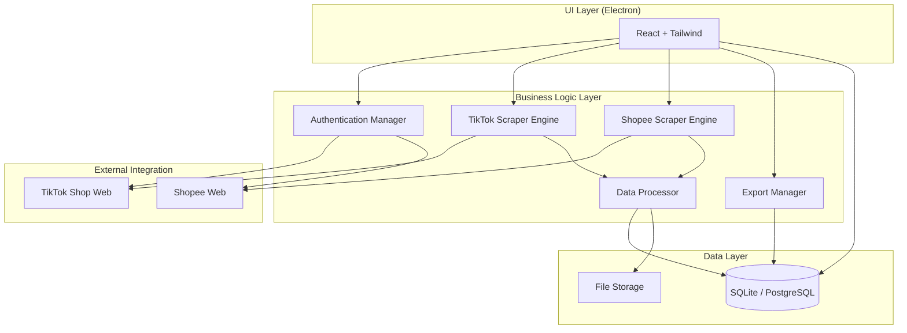
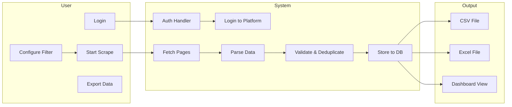
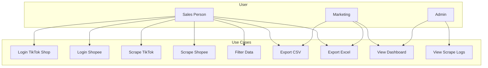
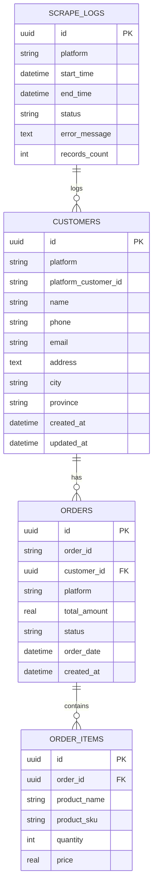
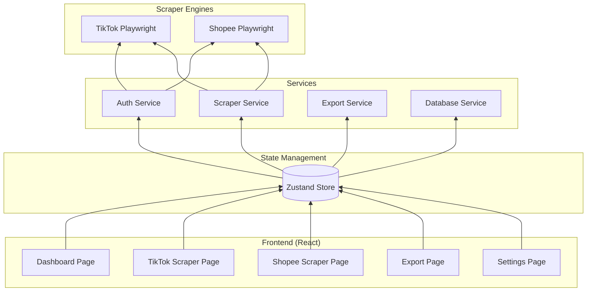

# BRD — MP-CRM-SCRAPER
## Business Requirements Document

---

# 1. Executive Summary

## 1.1 Project Overview
**MP-CRM-SCRAPER** adalah aplikasi desktop internal untuk mengekstrak data customer dari marketplace TikTok Shop dan Shopee. Aplikasi ini bertujuan untuk membantu tim sales dan marketing dalam aktivitas lead generation, customer profiling, dan CRM enrichment.

## 1.2 Problem Statement
Tim sales dan marketing membutuhkan data customer dari marketplace untuk:
- Mengidentifikasi潜在客户
- Melakukan customer profiling berdasarkan riwayat pembelian
- Mengirim targeted marketing campaign
- Mengisi dan memperkaya data CRM yang ada

Saat ini, tidak ada solusi internal yang efektif untuk mendapatkan data ini secara efisien dan terstruktur.

## 1.3 Proposed Solution
Aplikasi desktop yang dapat:
- Melakukan login ke akun TikTok Shop dan Shopee
- Mengekstrak data order dan customer
- Menyimpan data ke database lokal
- Mengekspor data ke format CSV/Excel untuk diimpor ke CRM

## 1.4 Target Users
| User Role | Description |
|-----------|-------------|
| Sales Person | Menggunakan data untuk lead generation dan follow-up |
| Marketing | Menggunakan data untuk campaign dan analisis |
| Admin | Mengatur settings dan monitoring |

---

# 2. Business Objectives

## 2.1 Primary Objectives
1. **Efisiensi ekstraksi data** — Memperoleh data customer dari TikTok Shop dan Shopee dalam waktu <10 menit untuk 1000+ order
2. **Data terstruktur** — Data disimpan dalam format terstruktur yang siap untuk dianalisis atau diimpor ke CRM
3. **Mudah digunakan** — Interface yang intuitif sehingga user dengan skill teknis minimal dapat menggunakannya

## 2.2 Secondary Objectives
1. **Visualisasi data** — Dashboard untuk melihat insight customer (lokasi, produk populer, dll)
2. **Otomasi terbatas** — Schedule scraping untuk data yang selalu up-to-date
3. **Export fleksibel** — Opsi export ke berbagai format dengan filter yang sesuai kebutuhan

---

# 3. User Stories

| ID | Actor | Story | Acceptance Criteria |
|----|-------|-------|---------------------|
| US-01 | Sales Person | Saya ingin login ke TikTok Shop melalui aplikasi | Dapat melakukan login dengan kredensial, session tersimpan |
| US-02 | Sales Person | Saya ingin login ke Shopee melalui aplikasi | Dapat melakukan login dengan kredensial, session tersimpan |
| US-03 | Sales Person | Saya ingin scrape data customer dari TikTok Shop | Data customer (nama, phone, alamat, order) berhasil diambil dan tersimpan |
| US-04 | Sales Person | Saya ingin scrape data customer dari Shopee | Data customer (nama, phone, alamat, order) berhasil diambil dan tersimpan |
| US-05 | Sales Person | Saya ingin filter data berdasarkan rentang tanggal | Hanya data dalam rentang tanggal yang dipilih yang diproses |
| US-06 | Sales Person | Saya ingin export data ke CSV | File CSV berhasil di-generate dengan semua field yang dipilih |
| US-07 | Sales Person | Saya ingin export data ke Excel | File Excel berhasil di-generate dengan formatting yang baik |
| US-08 | Marketing | Saya ingin melihat dashboard customer insights | Dashboard menampilkan total customer, order, dan distribusi berdasarkan lokasi |
| US-09 | Admin | Saya ingin melihat log scraping history | Semua operasi scraping tercatat dengan timestamp dan status |
| US-10 | Admin | Saya ingin atur jadwal scraping otomatis | Aplikasi dapat menjalankan scrape secara terjadwal tanpa interaksi user |

---

# 4. Functional Requirements

## 4.1 Authentication Module

| FR-ID | Requirement | Priority |
|-------|-------------|----------|
| FR-AUTH-01 | User dapat login ke TikTok Shop menggunakan username dan password | Critical |
| FR-AUTH-02 | User dapat login ke Shopee menggunakan username dan password | Critical |
| FR-AUTH-03 | Session login bertahan (tidak perlu login ulang untuk beberapa jam) | High |
| FR-AUTH-04 | User dapat logout dari platform | Medium |
| FR-AUTH-05 | Aplikasi menyimpan credential secara encrypted | Critical |

## 4.2 Data Extraction Module — TikTok Shop

| FR-ID | Requirement | Priority |
|-------|-------------|----------|
| FR-TT-01 | Aplikasi dapat mengakses halaman order TikTok Shop | Critical |
| FR-TT-02 | Aplikasi dapat mengekstrak nama customer | Critical |
| FR-TT-03 | Aplikasi dapat mengekstrak nomor telepon customer | High |
| FR-TT-04 | Aplikasi dapat mengekstrak alamat lengkap customer | High |
| FR-TT-05 | Aplikasi dapat mengekstrak detail pesanan (produk, jumlah, harga) | Critical |
| FR-TT-06 | Aplikasi mendukung filter rentang tanggal | High |
| FR-TT-07 | Aplikasi menangani pagination (ambil semua halaman) | High |
| FR-TT-08 | Aplikasi menampilkan progress saat scrape berlangsung | Medium |

## 4.3 Data Extraction Module — Shopee

| FR-ID | Requirement | Priority |
|-------|-------------|----------|
| FR-SP-01 | Aplikasi dapat mengakses halaman order Shopee | Critical |
| FR-SP-02 | Aplikasi dapat mengekstrak nama customer | Critical |
| FR-SP-03 | Aplikasi dapat mengekstrak nomor telepon customer | High |
| FR-SP-04 | Aplikasi dapat mengekstrak alamat lengkap customer | High |
| FR-SP-05 | Aplikasi dapat mengekstrak detail pesanan (produk, jumlah, harga, variant) | Critical |
| FR-SP-06 | Aplikasi mendukung filter rentang tanggal | High |
| FR-SP-07 | Aplikasi menangani pagination | High |
| FR-SP-08 | Aplikasi menampilkan progress saat scrape berlangsung | Medium |

## 4.4 Data Storage Module

| FR-ID | Requirement | Priority |
|-------|-------------|----------|
| FR-DB-01 | Data disimpan ke SQLite secara default | Critical |
| FR-DB-02 | Data dapat disimpan ke PostgreSQL (optional) | Low |
| FR-DB-03 | Tabel customers dibuat dengan schema yang sesuai | Critical |
| FR-DB-04 | Tabel orders dibuat dengan schema yang sesuai | Critical |
| FR-DB-05 | Tabel order_items dibuat dengan schema yang sesuai | Critical |
| FR-DB-06 | Tabel scrape_logs dibuat untuk tracking | High |
| FR-DB-07 | Semua record memiliki timestamp | High |

## 4.5 Data Export Module

| FR-ID | Requirement | Priority |
|-------|-------------|----------|
| FR-EXP-01 | User dapat export ke format CSV | Critical |
| FR-EXP-02 | User dapat export ke format Excel (.xlsx) | High |
| FR-EXP-03 | User dapat memilih field mana saja yang di-export | High |
| FR-EXP-04 | User dapat filter data sebelum export | High |
| FR-EXP-05 | File export dapat di-download langsung | Critical |

## 4.6 Dashboard Module

| FR-ID | Requirement | Priority |
|-------|-------------|----------|
| FR-DASH-01 | Menampilkan total customer yang berhasil discrape | High |
| FR-DASH-02 | Menampilkan total order | High |
| FR-DASH-03 | Menampilkan timestamp terakhir scrape | Medium |
| FR-DASH-04 | Menampilkan distribusi customer berdasarkan kota/provinsi | Medium |
| FR-DASH-05 | Menampilkan top produk yang sering dibeli | Medium |

## 4.7 Settings Module

| FR-ID | Requirement | Priority |
|-------|-------------|----------|
| FR-SET-01 | User dapat mengatur database (SQLite/PostgreSQL) | Medium |
| FR-SET-02 | User dapat melihat informasi aplikasi dan versi | Low |
| FR-SET-03 | User dapat mengatur schedule scraping (future) | Low |

---

# 5. Non-Functional Requirements

| Requirement | Description |
|-------------|-------------|
| **Performance** | Mampu scrape 1000+ order dalam 10 menit |
| **Reliability** | Auto-retry maximal 3x saat network fail |
| **Security** | Credential di-encrypt menggunakan AES-256 |
| **Privacy** | Data customer di-hidden secara default |
| **Error Handling** | Pesan error yang jelas untuk user |
| **Logging** | Semua operasi di-log dengan timestamp |
| **Usability** | User dapat menggunakan aplikasi tanpa training khusus |

---

# 6. System Architecture

## 6.1 High-Level Architecture



## 6.2 Data Flow Diagram



## 6.3 Use Case Diagram



## 6.4 Database ERD



## 6.5 Component Diagram



---

# 7. UI/UX Requirements

## 7.1 Layout Structure

```
┌─────────────────────────────────────────────────────────┐
│ Header: Logo + Title + User Menu + Settings              │
├─────────────┬─────────────────────────────────────────────┤
│ Sidebar     │ Main Content Area                           │
│ - Dashboard │ (Changes based on selected menu)          │
│ - TikTok    │                                             │
│ - Shopee    │                                             │
│ - Export    │                                             │
│ - Settings  │                                             │
├─────────────┴─────────────────────────────────────────────┤
│ Footer: Status Bar + Version                             │
└─────────────────────────────────────────────────────────┘
```

## 7.2 Screen Specifications

### Screen 1: Login
- Platform selector (TikTok / Shopee)
- Username field
- Password field
- Login button
- Status indicator

### Screen 2: Dashboard
- 3 cards: Total Customers, Total Orders, Last Scrape Time
- 2 charts: Customer by Location (pie), Top Products (bar)
- Recent activity table

### Screen 3: Scraper (TikTok/Shopee)
- Login status indicator
- Date range picker
- Options checkboxes
- Large "Start Scrape" button
- Progress bar
- Results preview table
- Export buttons

### Screen 4: Export
- Platform filter
- Date range filter
- Field selector (checkboxes)
- Preview table
- Export buttons (CSV, Excel)

### Screen 5: Settings
- Database config
- About info

---

# 8. Risks & Mitigation

| Risk | Impact | Mitigation |
|------|--------|------------|
| Akun ter-banned | High | Gunakan akun khusus scraping, batasi frekuensi |
| Rate limiting | Medium | Implementasi delay antar request |
| Website layout change | Medium | Modular scraper, easy to update selectors |
| Data privacy violation | High | Batasi akses, encrypt sensitive data |
| Network failure | Low | Auto-retry mechanism |

---

# 9. Success Metrics

| Metric | Target |
|--------|--------|
| Waktu scrape 1000 order | < 10 menit |
| Keberhasilan login | > 95% |
| Data accuracy | > 90% |
| User satisfaction | > 4/5 |

---

# 10. Timeline (Estimated)

| Phase | Duration | Deliverable |
|-------|----------|-------------|
| Phase 1: Core Development | 2-3 minggu | Login + Scraping + Storage |
| Phase 2: Export & Dashboard | 1-2 minggu | Export feature + Dashboard |
| Phase 3: Polish & Testing | 1 minggu | Bug fixing + UI refinement |
| **Total** | **4-6 minggu** | **v1.0.0** |

---

# 11. Approval

| Role | Name | Date | Signature |
|------|------|------|-----------|
| Project Sponsor | | | |
| Product Owner | | | |
| Technical Lead | | | |
| Business Representative | | | |

---

*End of BRD Document*