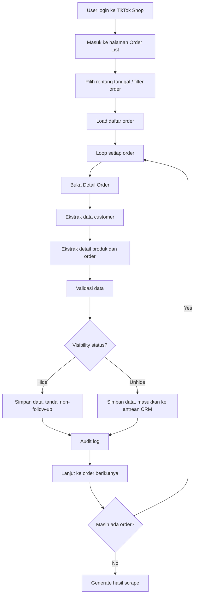
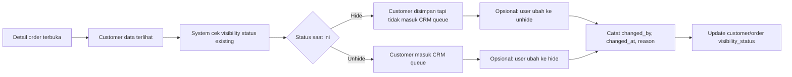
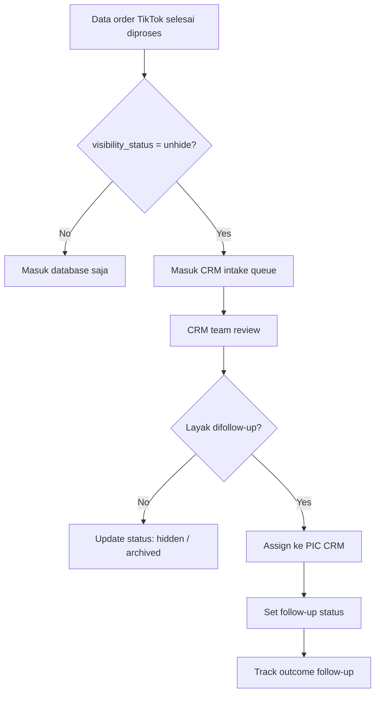

# TikTok Detail Order Flow

Dokumen ini menjelaskan alur scraping TikTok Shop yang berfokus pada:
- order list
- detail order
- status hide / unhide
- antrean follow-up CRM

---

## 1. High-Level Flow

---

## 2. Detail Decision Flow — Hide / Unhide

---

## 3. CRM Follow-up Queue Flow

---

## 4. Suggested Data Fields

### Order-level
- order_id
- platform = tiktok
- order_date
- order_status
- total_amount
- product_summary
- visibility_status (`hide` / `unhide`)
- visibility_reason
- visibility_changed_by
- visibility_changed_at

### Customer-level
- customer_name
- phone
- address
- city
- province
- last_order_id
- last_seen_at
- crm_followup_status
- assigned_to
- notes

---

## 5. Scope Notes

1. Scraping TikTok harus masuk sampai **detail order**, bukan hanya list.
2. Hide/unhide adalah bagian dari **business workflow**, bukan cuma tampilan UI.
3. CRM queue hanya menerima customer/order dengan status **unhide**.
4. Semua perubahan visibility harus masuk **audit trail**.

---

## 6. Suggested Future Enhancements

- multi-step approval sebelum unhide
- assignment otomatis ke tim CRM berdasarkan kota / produk
- duplicate detection lintas order customer yang sama
- CRM score untuk prioritas follow-up

---

*End of TikTok Detail Order Flow Document*